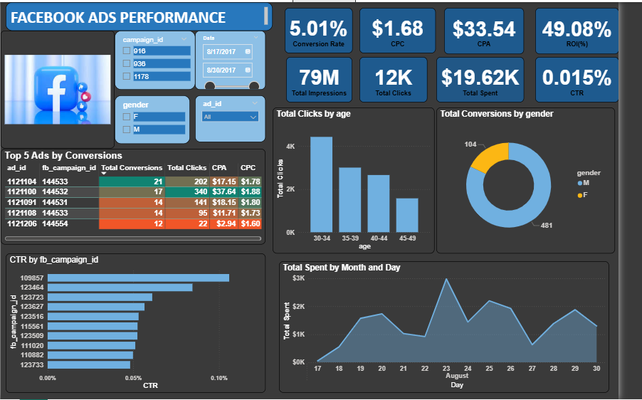

# Facebook Ads Performance Dashboard

## 📌 Overview
This project presents an interactive **Facebook Ads Performance Dashboard** designed to analyze conversions, clicks, impressions, spending, and demographic engagement across multiple Facebook ad campaigns.

---

## ✨ Key Features
- Interactive filters: campaign ID, date range, gender, ad ID  
- KPI cards:
  - Conversion Rate  
  - CPC (Cost Per Click)  
  - CPA (Cost Per Acquisition)  
  - ROI (%)  
  - Total Impressions  
  - Total Clicks  
  - Total Conversions  
  - Total Spend  
  - CTR (Click-Through Rate)
- Top 5 Ads by Conversions (with conditional formatting)
- CTR by Campaign bar chart
- Total Clicks by Age Group
- Conversions by Gender (donut chart)
- Total Spend by Month and Day (line chart)

---

## Dashboard Preview

---

## 🛠️ Skills and Tools
- **Power BI Desktop**
- **Power Query** and **Excel** for data cleaning
- **DAX** for calculated measures
- **Data Modeling**
- **Data Visualization & Dashboard Design**

---

## 📊 Data
The Dataset is a CSV file from Kaggle. It includes Campaign ID, Ad ID, Reporting dates, Gender, Age, Impressions, Clicks and Approved conversions

---

## 📈 Insights
- The overall CTR (0.015%) is pretty low indicating low engagement of the ads. 
- Several ads received high impressions but very few clicks, suggesting the audience sees the ads but doesn't find them compelling. 
- CTR is highest among ages 30-34 and lowest for 45-49. 
- Male audience have a higher conversion rate than Female audience.
- Ads with low CTR are also underperforming in conversions, leading to higher CPA and CTC.
- ROI is 49.08%, indicating the campaign is profitable, however the low CTR suggests that there is room to ipmrove ad engagement and further increase returns.

---
## Recommendations
- Reallocate budget to campaigns and ads with higher CTR and Conversion rate
- Revise low-performing ads to improve engagement.
- Refine audience targeting based on demographics and interests.
- Test new creatives for underperforming ad segments.

---

## 🚀 How to Use
1. Download the `.pbix` file.  
2. Open it in **Power BI Desktop**.  
3. Use the slicers to filter by campaign, gender, date, and ad ID.  
4. Interact with the visuals to explore campaign performance. 

---

## 📄 License
This project is for learning and educational purposes as part of my internship at Future Interns

---
